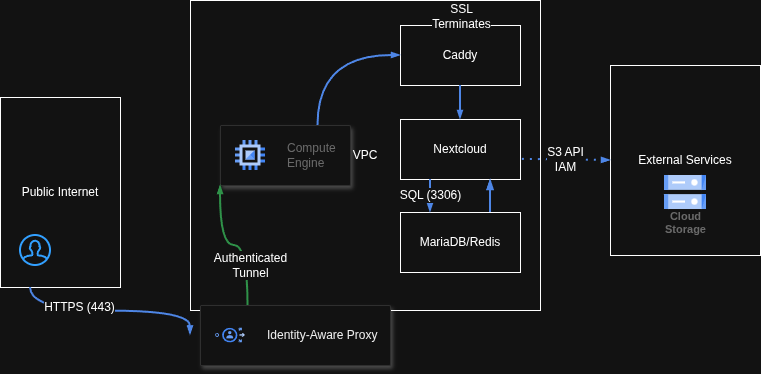

# GCP Cloud-Native Nextcloud Deployment

A security-hardened, cloud-native Nextcloud deployment on Google Cloud Platform (GCP). This project demonstrates a production-grade architecture utilizing Container-Optimized OS (COS), decoupled object storage, and Identity-Aware Proxy (IAP) for secure administrative access.

## 🛠 Technical Architecture & Implementation

### Phase 1 & 3: Compute & Cloud Governance
* **Infrastructure:** Provisioned a **Google Compute Engine (GCE)** instance running **Container-Optimized OS (COS)** to minimize the OS-level attack surface.
* **Orchestration:** Deployed a multi-tier stack using **Docker Compose**, isolating the Application, Database (MariaDB), and Caching (Redis) layers.

### Phase 2: VPC Networking & Security Hardening
* **Strict Default Deny:** Engineered a custom VPC with firewall rules that drop all ingress traffic by default.
* **IAP Integration:** Implemented **Identity-Aware Proxy (IAP)**, allowing administrative access only via authenticated Google identities, effectively eliminating the need for public-facing SSH ports.

### Phase 4 & 5: Decoupled Storage & Persistence
* **Object Storage:** Architected a stateless application environment by offloading user data to **Google Cloud Storage (GCS)** via an S3-interoperability layer.
* **IAM Service Accounts:** Enforced the Principle of Least Privilege by using dedicated IAM Service Accounts for programmatic bucket access.
* **Troubleshooting:** Resolved a critical **400 Bad Request (XML API)** error by transitioning bucket access from **Uniform** to **Fine-grained**, enabling the necessary metadata headers for S3-compatibility.

### Phase 6: Edge Security & SSL
* **Reverse Proxy:** Utilized **Caddy** for automated **TLS/SSL termination** via Let's Encrypt.
* **Header Hardening:** Configured HSTS, X-Frame-Options (Clickjacking protection), and Content-Security-Policy (CSP) to achieve an **"A" rating** on security
